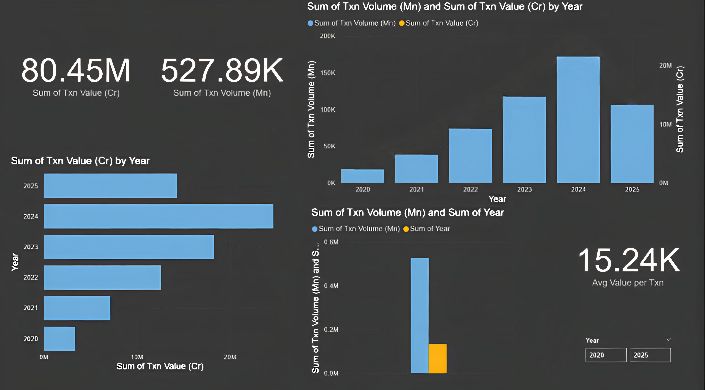

# UPI MONTHLY INSIGHTS 2020–2025

This project contains a Power BI dashboard analyzing monthly UPI (Unified Payments Interface) transaction trends in India from January 2020 to July 2025.

## Dashboard Preview

## Key Highlights

- Total Transaction Volume: 527.89K Million  
- Total Transaction Value: ₹80.45 Million Crores  
- Average Transaction Value: ₹15.24K

## Files

- `dashboard/upi_dashboard.png` – Dashboard image  
- `data/upi_monthly_data_2020_2025.csv` – Monthly UPI data  
- `README.md` – Project overview

## Tools Used

- Power BI  
- Excel / CSV

## Author

Kaushik Kumar Nayak  
GitHub: [kaushikzero4](https://github.com/kaushikzero4)  
LinkedIn: [kaushikzero4](https://www.linkedin.com/in/kaushikzero4)
